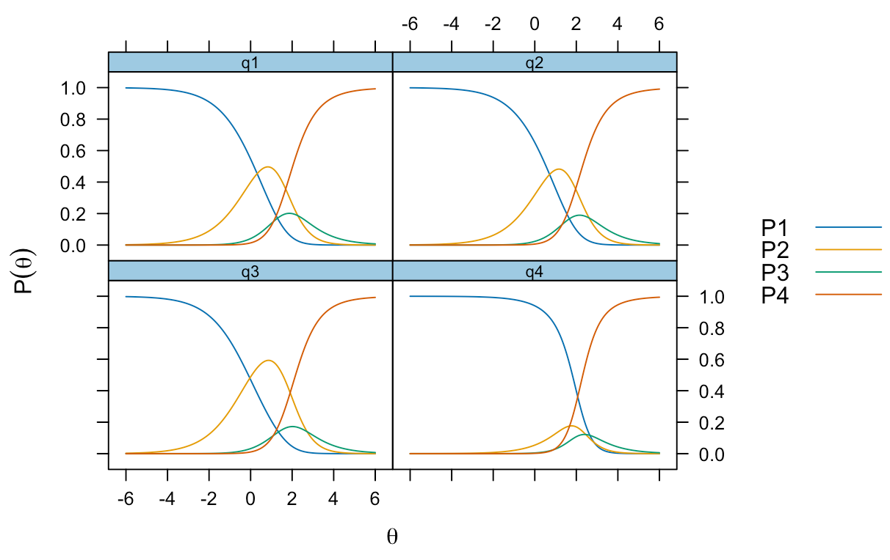
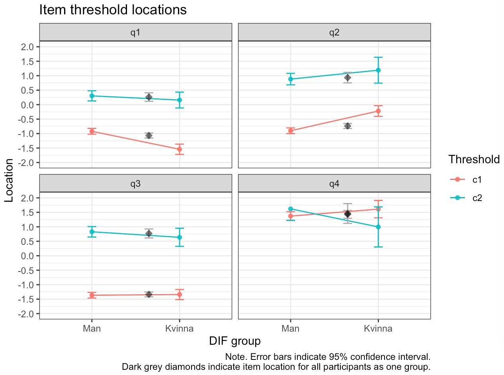
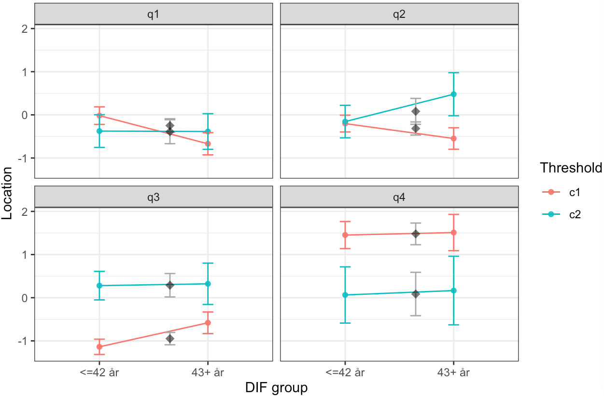
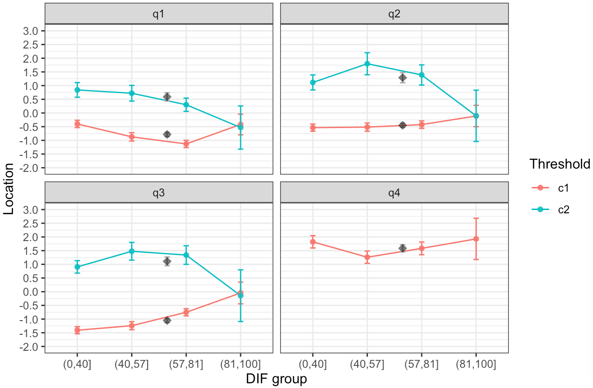
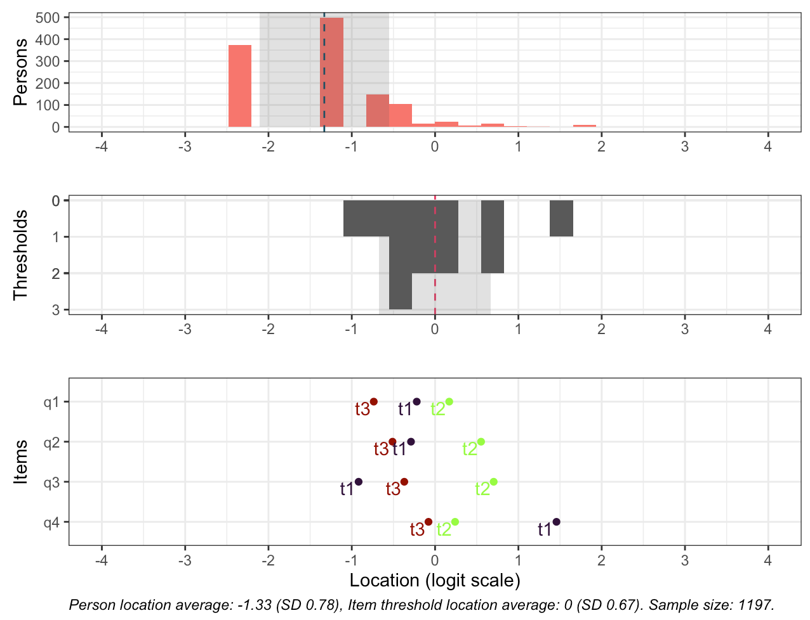
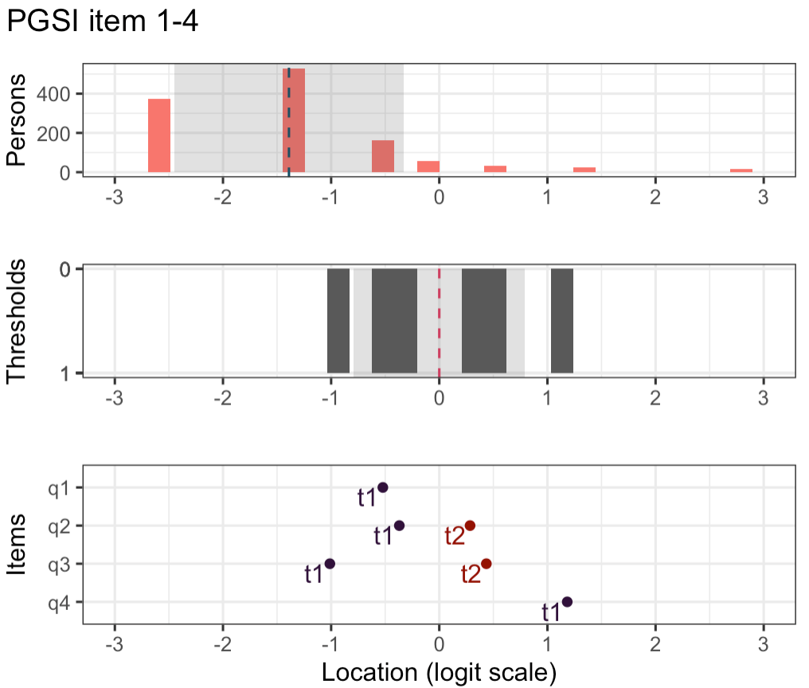
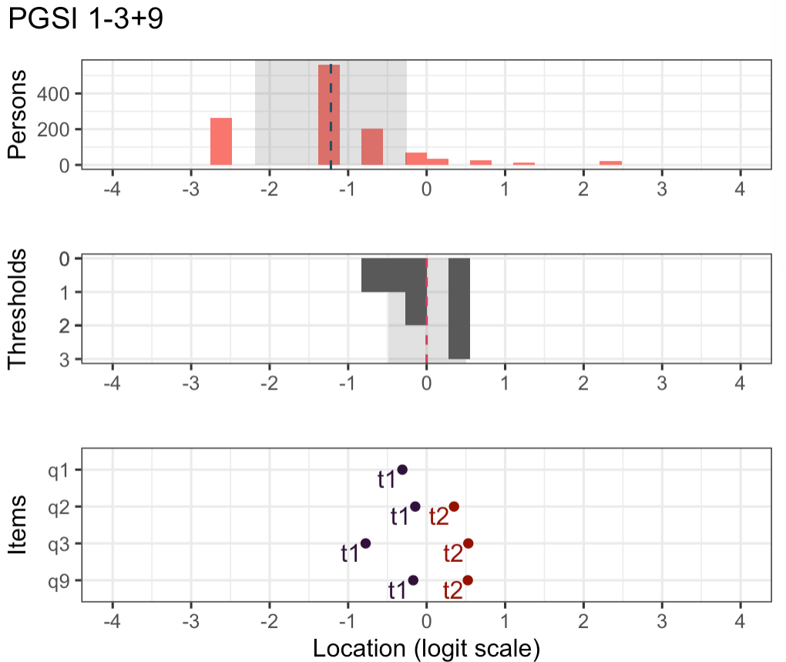
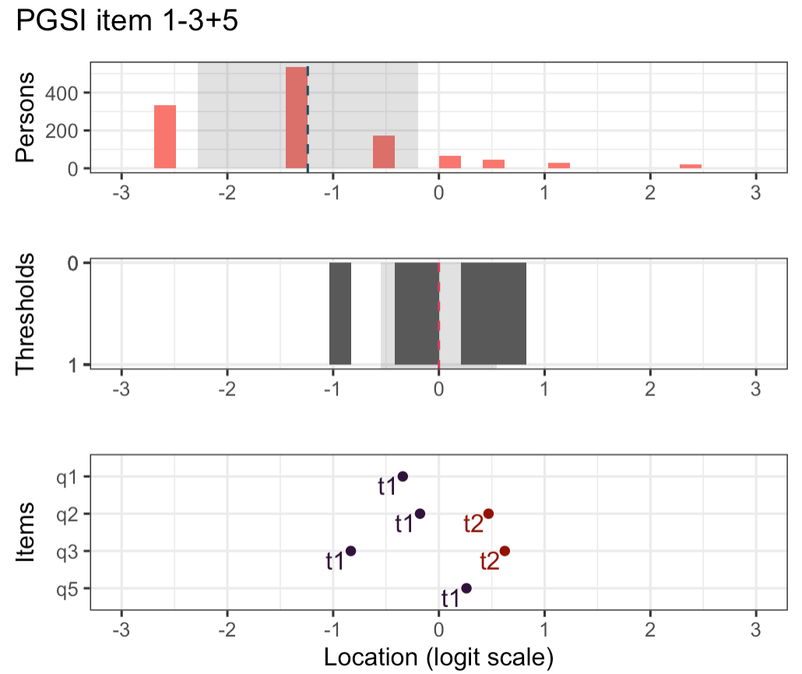

## PGSI-4 och dataunderlag

PGSI-4 = de fyra första frågorna i PGSI-9. Används i **Hälsa på Lika Villkor (HLV)** för att mäta viss risk för spelproblem (1–2 poäng) respektive problemspelande (3+ poäng).

::: {style="font-size:0.6em"}
| Item | Frågeställning |
|:----:|:---------------|
| q1 | har du spelat för mer än du verkligen haft råd att förlora? |
| q2 | har du behövt spela med större summor för att få samma känsla av spänning? |
| q3 | har du återvänt en annan dag för att försöka vinna tillbaka pengarna du förlorat? |
| q4 | har du lånat pengar eller sålt något för att ha pengar att spela för? |

: {tbl-colwidths="[8,92]"}
:::

. . .

- **HLV** 2014–2024: 3118 respondenter med svar över noll + 300 med nollsvar
- Jämförande analyser av item 1–4 från **Swelogs**, **USUF**, **Stödlinjen**, samt öppna kanadensiska data [[@cooperSeparatingBehaviours2023]]{style="font-size:0.6em"}

## Dimensionalitet och lokala beroenden {.ljusbla}

::: {.incremental}
- **Item 4** är overfit i flera (men inte alla) analyser
- **Item 4 har lokala beroenden i samtliga analyser** — främst med item 1, men även med item 3
- Även item 2 och 3 uppvisar lokalt beroende
- CFA på HLV-data: **negativ residualvarians för item 4** — modellen konvergerar inte korrekt, oavsett hur svarskategorierna slås samman
:::

. . .

::: {.callout-note appearance="simple"}
Oväntade svarsmönster (U3): 9–11% av respondenterna flaggas. Vanligast är svar ”Ibland” eller högre på item 4 trots ”Aldrig” på övriga tre.
:::

## Svarskategorier

:::: {.columns}
::: {.column width="60%"}
{fig-alt="Sannolikhetskurvor för svarskategorierna för item 1-4 i HLV relativt den latenta variabeln. Kurvan för Ofta är aldrig den mest sannolika svarskategorin och överlappar nästan helt med Nästan alltid."}
:::

::: {.column width="40%"}
- **Samtliga item har oordnade svarströsklar**: ”Ofta” är i princip identisk med ”Nästan alltid”
- Item 4 har problem med flera kategorier är i princip dikotom
- Samma mönster i Swelogs; något mildare i Stödlinjen, men avstånden är även där mycket små
:::
::::

## Invarians: kön

:::: {.columns}
::: {.column width="60%"}
{fig-alt="Tröskelvärden per item uppdelat på kön i HLV. Den lägsta tröskeln för item 1 och 2 skiljer sig med cirka 0.6-0.7 logits mellan män och kvinnor."}
:::

::: {.column width="40%"}
- Item 1 och 2: den **lägsta svarströskeln** skiljer 0.62 respektive 0.68 logits mellan kön

. . .

::: {.callout-important appearance="simple"}
[Den lägsta tröskeln (”Ibland” vs ”Aldrig”) är avgörande vid screening — skillnaderna kan ge **könsbias i klassificeringen**.]{style="font-size:0.9em"}
:::
:::
::::

## Invarians: ålder {style="margin-bottom:0 !important;"}

:::: {.columns}
::: {.column width="60%"}
{fig-alt="Tröskelvärden per item för åldersgrupper under respektive över 42 år i Swelogs. Den lägsta tröskeln för item 1-3 skiljer sig med 0.55-0.65 logits mellan grupperna." width="72%" style="margin:0; display:block;"}
{width="72%"}
:::

::: {.column width="40%"}
- Återkommande mönster i flera dataset: skillnader **över/under ca 40 års ålder**
- I Swelogs: lägsta tröskeln för item 1–3 skiljer 0.55–0.65 logits
- I HLV (nedre bild): störst avvikelser för gruppen 81+ (få respondenter)
- Trösklarna är **stabila över tid** (insamlingsår)
:::
::::

::: footer
:::

## Targeting

:::: {.columns}
::: {.column width="60%"}
{fig-alt="Targetingfigur för PGSI-4 i Swelogs: personfördelning, tröskeltäckning och items tröskelplaceringar. Item 4 har sin lägsta tröskel klart högre än item 1-3."}
:::

::: {.column width="40%"}
- Item 1–3 är de **enklaste** av alla items i PGSI — psykometriskt logiskt för screening
- **Item 4 avviker tydligt**: lägsta tröskeln ligger ca 2 logits högre än övriga
- Item 4 mäter alltså en betydligt högre problemnivå — tveksamt i ett screeningsyfte
:::
::::

## Reliabilitet

[Estimeras med sammanslagna svarskategorier (item 1–3) och dikotomiserat item 4, som en pragmatisk lösning på problemen med oordnade trösklar.]{style="font-size:0.8em"}

:::: {.columns}
::: {.column width="45%"}
::: {style="font-size:0.65em"}
| Ordinal summapoäng | Conditional reliability (McDonald's $\omega$) |
|:---:|:---:|
| 0 | 0.39 |
| 1 | 0.47 |
| 2 | 0.53 |
| 3 | 0.57 |
| 4 | 0.59 |
| 5 | 0.60 |
:::
:::
::: {.column width="10%"}
:::
::: {.column width="45%"}
- Reliabiliteten är **låg över hela skalan** — som högst 0.60
- Fyra item med få fungerande svarströsklar ger begränsad information
:::
::::

## Alternativ kortversion? {.ljusbla}

Givet item 4:s höga trösklar har vi testat att ersätta det med **item 5** (*”känt att du kanske har problem...”*) eller **item 9** (*”känt skuld...”*) i Swelogs-data:

::: {.incremental}
- **Item 5**: inga problem med item fit; lägsta tröskeln ca 1 logit lägre än item 4
- **Item 9**: fungerar utan anmärkningar med item 1–3, har ännu lägre tröskelvärde — och dessutom en extra fungerande svarströskel
- Båda centrerar måttet mot den **lägre delen av den latenta skalan**, där screening behöver information
- Att använda *både* item 5 och 9 tillsammans med item 1–3 resulterar däremot i psykometriska problem (multidimensionalitet)
:::

## Targeting: item 1–4 vs item 1–3 + 9

:::: {.columns}
::: {.column width="50%"}
[**PGSI-4** (item 1–4)]{style="font-size:0.9em"}

{fig-alt="Targetingfigur för item 1-4 i Swelogs. Item 4 har sin enda fungerande tröskel högt upp på skalan, kring 1.2 logits."}
:::

::: {.column width="50%" .fragment}
[**Alternativ** (item 1–3 + 9)]{style="font-size:0.9em"}

{fig-alt="Targetingfigur för item 1-3 plus item 9 i Swelogs. Item 9 har två fungerande trösklar placerade lägre på skalan, närmare personfördelningen."}
:::
::::

[Item 9 ger information närmare populationens nivå — och en extra svarströskel (t2) jämfört med både item 4 och 5.]{style="font-size:0.8em"}

## Targeting: item 1–4 vs item 1–3 + 5

:::: {.columns}
::: {.column width="50%"}
[**PGSI-4** (item 1–4)]{style="font-size:0.9em"}

{fig-alt="Targetingfigur för item 1-4 i Swelogs. Item 4 har sin enda fungerande tröskel högt upp på skalan, kring 1.2 logits."}
:::

::: {.column width="50%" .fragment}
[**Alternativ** (item 1–3 + 5)]{style="font-size:0.9em"}

{fig-alt="Targetingfigur för item 1-3 plus item 5 i Swelogs. Item 5 har två fungerande trösklar placerade lägre på skalan, närmare personfördelningen."}
:::
::::

[Item 5 ger information närmare populationens nivå]{style="font-size:0.8em"}

## Sammanfattning {.blue}

::: {.incremental}
- **Svarskategorierna fungerar inte som avsett** — ”Ofta” och ”Nästan alltid” behöver omarbetas, kvalitativt och kvantitativt
- **Item 4**: lokala beroenden med item 1 och 3, och betydligt högre trösklar än övriga — tveksamt val för screening
- **Viss invariansproblematik** för kön och ålder (över/under ca 40 år) kring den lägsta svarströskeln — relevant för screeninggränser
- **Låg reliabilitet** över hela skalan
- Item 5 eller 9 är psykometriskt bättre partner till item 1–3 än item 4 — men **innehållsvaliditet** måste beaktas i en eventuell revidering
- Vid revidering: **testekvivalering** kan översätta mätvärden mellan gammal och ny version
:::

## Tack! {.plum .centered} 

:::: {.columns}
::: {.column width="40%"}
**Magnus Johansson, PhD**
:::

::: {.column width="40%"}
**Kristoffer Magnusson, MD**
:::
::::
 
Department of Clinical Neuroscience
 

 

::: {}
{width="50%"}
:::

## Referenser
