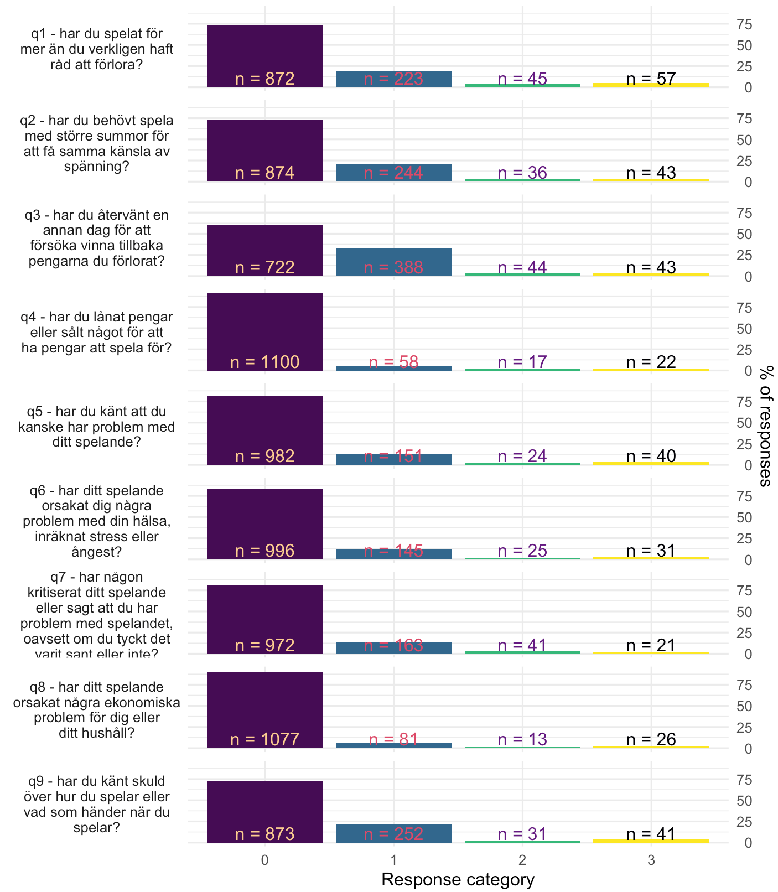
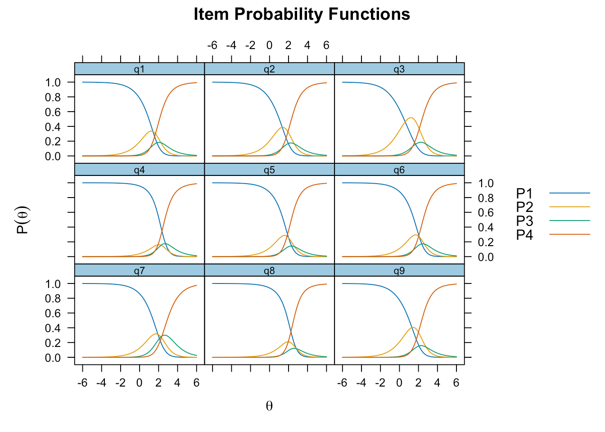
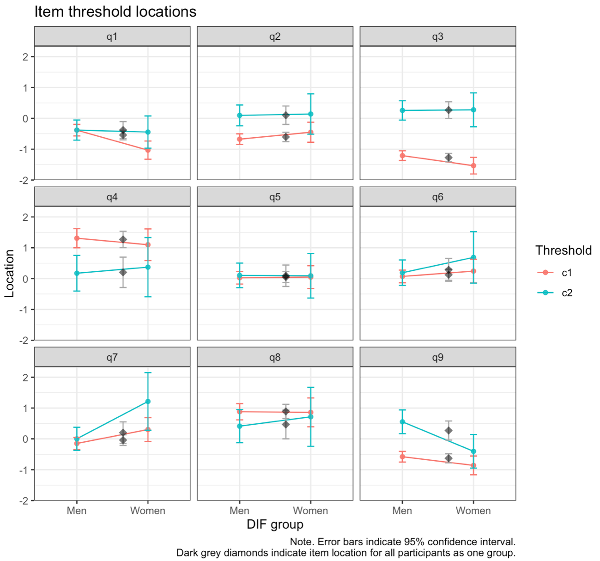
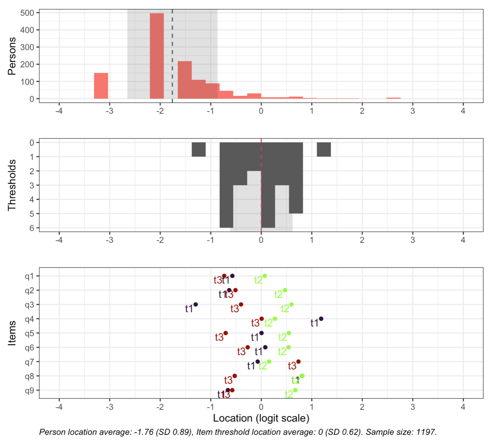
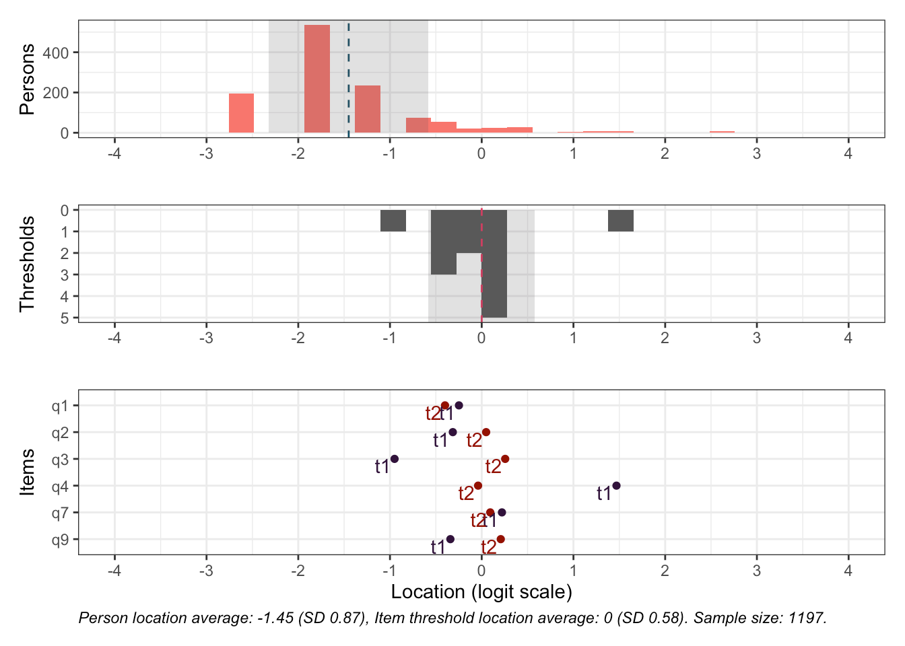
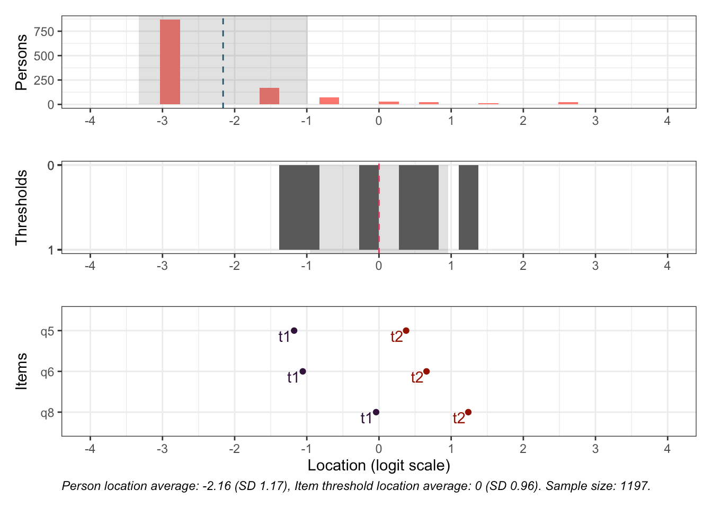
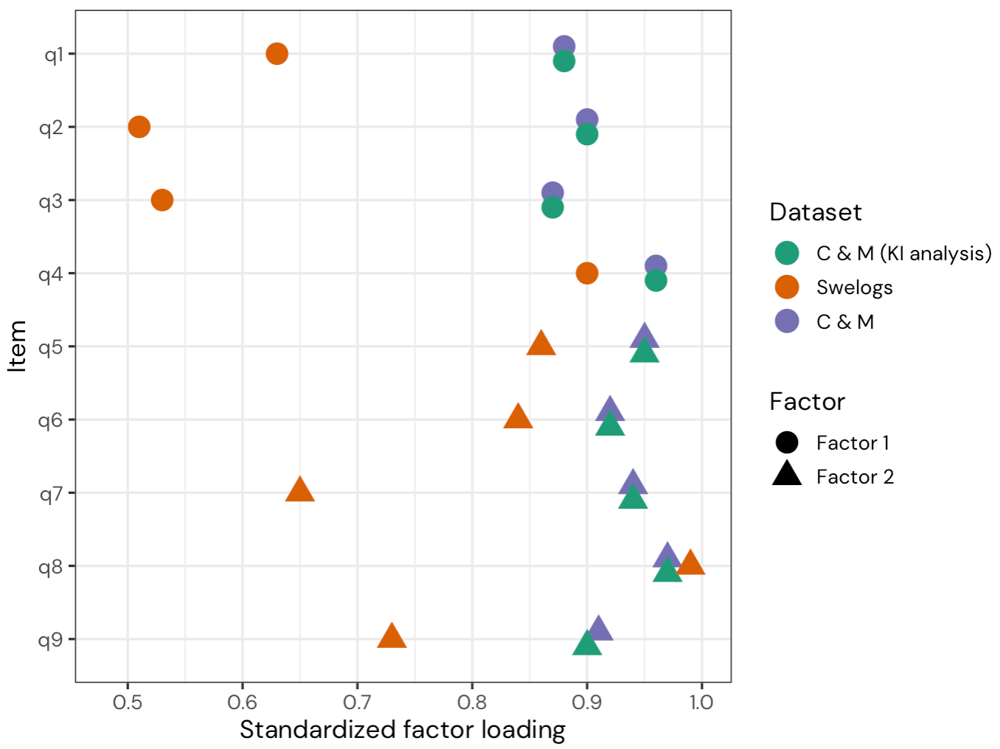

## Uppdraget

- Folkhälsomyndigheten ska få **bättre kunskap om mätegenskaperna** hos PGSI-9 och PGSI-4, samt deras relation till andra mått på ohälsa.
- Psykometriska analyser baserade på:
  * **Swelogs** 2015, 2018, 2021 (PGSI-9)
  * **Undersökning om spel om pengar bland unga och föräldrar (USUF)** 2021 (PGSI-9)
  * **Hälsa på Lika Villkor - HLV** 2014–2024 (PGSI-4)
- Kompletterande analyser av **Stödlinjen**s data från 2021 samt ett öppet kanadensiskt dataset [[@cooperSeparatingBehaviours2023]]{style="font-size:0.6em"}
- Litteraturöversikt över tidigare psykometriska utvärderingar av PGSI

## PGSI:s nio frågor

[*"Om du tänker på de senaste 12 månaderna, ..."*]{style="font-size:0.8em"}

::: {style="font-size:0.55em"}
| Item | Frågeställning |
|:----:|:---------------|
| **q1** | har du spelat för mer än du verkligen haft råd att förlora? |
| **q2** | har du behövt spela med större summor för att få samma känsla av spänning? |
| **q3** | har du återvänt en annan dag för att försöka vinna tillbaka pengarna du förlorat? |
| **q4** | har du lånat pengar eller sålt något för att ha pengar att spela för? |
| q5 | har du känt att du kanske har problem med ditt spelande? |
| q6 | har ditt spelande orsakat dig några problem med din hälsa, inräknat stress eller ångest? |
| q7 | har någon kritiserat ditt spelande eller sagt att du har problem med spelandet, oavsett om du tyckt det varit sant eller inte? |
| q8 | har ditt spelande orsakat några ekonomiska problem för dig eller ditt hushåll? |
| q9 | har du känt skuld över hur du spelar eller vad som händer när du spelar? |

: {tbl-colwidths="[8,92]"}
:::

[Svarskategorier: **Aldrig** (0), **Ibland** (1), **Ofta** (2), **Nästan alltid** (3). Item 1–4 (fetstil) utgör kortversionen PGSI-4.]{style="font-size:0.7em"}

## Metod {.ljusbla}

Fyra grundläggande mätegenskaper analyseras [[@christensenRaschModelsHealth2013]]{style="font-size:0.6em"}:

- **Unidimensionalitet** — mäter alla frågor samma sak?
- **Lokalt oberoende** — är frågor relaterade enbart via den latenta variabeln?
- **Ordnade svarskategorier** — fungerar svarsalternativen som avsett?
- **Invarians** — fungerar frågorna likadant för olika grupper och över tid?

. . .

Rasch-metodik (partial credit model) som primär metod, konfirmatorisk faktoranalys (CFA) som komplement.

::: {.callout-tip appearance="simple"}
Till skillnad från nästan alla tidigare publicerade analyser använder vi **simuleringsbaserade gränsvärden** i stället för tumregler — gränsvärden anpassade till data och items som analyseras [[@johanssonDetectingItemMisfit2025; @muller_item_2020; @christensen2017; @mcneishDirectDiscrepancyDynamic2024]]{style="font-size:0.6em"}
:::

## Tidigare forskning: litteraturöversikt

- 33 studier identifierade, 2001–2025 
  * 28 använde faktoranalys, 7 inkluderade IRT/Rasch

::: {.incremental}
- De flesta drar slutsatsen att PGSI är **endimensionell** — men:
  * alla utom en använde **tumregelsbaserade gränsvärden**
  * olämpliga estimatorer för ordinaldata (ML) var vanliga
  * lokala beroenden analyserades i endast 5 studier, svarskategorier i 4
- Några studier fann **två dimensioner**: item 1–4 och 5–9, med hög korrelation mellan faktorerna (*r* = 0.88–0.97)
- Oordnade svarskategorier för de två högsta kategorierna har påvisats tidigare, men inte följts upp
:::

::: {.callout-note appearance="simple"}
[James et al. [-@jamesDisorderedGambling2025] innehåller en välgjord översikt och rekommenderas som komplement till vår rapport.]{style="font-size:0.9em"}
:::

## Data: Swelogs

:::: {.columns}
::: {.column width="55%"}
{fig-alt="Stapeldiagram över svarsfördelningen per item för PGSI-9 i Swelogs. Den stora majoriteten svarar Aldrig på samtliga item, och mycket få svar finns i kategorierna Ofta och Nästan alltid." height="540"}
:::

::: {.column width="45%" .incremental}
- Swelogs 2015 + 2018 + 2021
- 1047 respondenter med svar över noll, plus 100 med nollsvar
- 69% män

- **Påtaglig golveffekt**
  - Mycket få svar i ”Ofta” och ”Nästan alltid” — begränsar analyser i subgrupper
:::
::::

::: footer
:::

## Dimensionalitet: minst två dimensioner {.ljusbla}

Samtliga analysmetoder visar på **multidimensionalitet**:

- Item 2 och 3 (delvis 1) är *underfit*
- Item 5, 6 och 8 är *overfit*, med flera lokala beroenden sinsemellan

. . .

**Tidigare föreslagen indelning i item 1–4 och 5–9 passar inte data.**

En bättre fungerande indelning:

:::: {.columns}
::: {.column width="50%"}
**Faktor 1**: item 1–4, 7 och 9

[beteenden och upplevelser]{style="font-size:0.8em"}
:::

::: {.column width="50%"}
**Faktor 2**: item 5, 6 och 8

[*problem* med spelande, hälsa och ekonomi]{style="font-size:0.8em"}
:::
::::

. . .

::: {.callout-note appearance="simple"}
Analyserade som separata delskalor fungerar item fit väl för båda faktorerna i Swelogs-data.
:::

## Svarskategorier

:::: {.columns}
::: {.column width="60%"}
{fig-alt="Sannolikhetskurvor för svarskategorierna för samtliga nio item relativt den latenta variabeln. Kurvorna för Ofta och Nästan alltid ligger nästan helt överlappande för alla item, och Ofta är aldrig den mest sannolika svarskategorin."}
:::

::: {.column width="40%"}
- **”Ofta” och ”Nästan alltid” är i princip identiska** för samtliga item, sett till sannolikhet givet den latenta variabeln
- Item 4, 5, 6 och 8 är i princip dikotoma

::: {.callout-important appearance="simple" .fragment}
[Svarskategoriernas utformning bör omarbetas inför ny datainsamling — kvalitativt **och** kvantitativt.]{style="font-size:0.9em"}
:::
:::
::::

## Invarians

:::: {.columns}
::: {.column width="60%"}
{fig-alt="Punktdiagram över tröskelvärden per item uppdelat på kön, med de två högsta svarskategorierna sammanslagna. De flesta item är stabila men vissa trösklar skiljer sig mellan män och kvinnor."}
:::

::: {.column width="40%"}
- Över tid (2015–2021): stabila i genomsnitt, men brokigare på tröskelnivå
- Vissa skillnader mellan kön
- De två högsta svarskategorierna har slagits samman i analyserna — för få svar i subgrupper
:::
::::

## Targeting

:::: {.columns}
::: {.column width="60%"}
{fig-alt="Targetingfigur med tre paneler: fördelning av personernas mätvärden, svarströsklarnas täckning, och varje items tröskelplaceringar på logitskalan. Personfördelningens medelvärde ligger vid -1.76 logits medan items trösklar är centrerade kring 0."}
:::

::: {.column width="40%"}
- Respondenternas medelvärde: **−1.76 logits**; items trösklar centrerade kring 0
- Frågorna mäter en **betydligt högre problemnivå** än där större delen av befolkningen befinner sig
- Mest information om respondenter med förhöjd risk — lite information i den lägre delen av skalan
:::
::::

## Två delskalor — targeting

:::: {.columns}
::: {.column width="50%"}
[**”PGSI-6”** (item 1–4, 7, 9)]{style="font-size:0.9em"}

{fig-alt="Targetingfigur för delskalan med item 1-4, 7 och 9, med de två högsta svarskategorierna sammanslagna."}
[**Faktor 1**: item 1 och 7 har fortfarande oordnade trösklar efter sammanslagning av de två högsta kategorierna.]{style="font-size:0.7em"}
:::

::: {.column width="50%" .fragment}
[**”PGSI-3”** (item 5, 6, 8)]{style="font-size:0.9em"}

{fig-alt="Targetingfigur för delskalan med item 5, 6 och 8, med de två högsta svarskategorierna sammanslagna. Inga svarströsklar är oordnade."}
[**Faktor 2**: inga oordnade trösklar efter sammanslagning. **Korrelation** F1 & F2 *r* = 0.51]{style="font-size:0.7em"}
:::
::::

## CFA: jämförelse med kanadensiska data

- Cooper & Marmurek [-@cooperSeparatingBehaviours2023] använde tumregelsbaserade gränsvärden och bedömde att både 1- och 2-faktormodellen (item 1–4 / 5–9) passade data.
- Vår omanalys med **simuleringsbaserade gränsvärden** (DFI): *ingen* av modellerna passar — varken i deras data eller i Swelogs.
- Endast **”PGSI-6”** (item 1–4, 7, 9) med Swelogs-data uppvisar acceptabel modellpassning.

## CFA: jämförelse (2/2)

:::: {.columns}
::: {.column width="60%"}
{fig-alt="Standardiserade faktorladdningar från CFA med två faktorer, jämförelse mellan Swelogs och det kanadensiska datasetet. Swelogs visar betydligt lägre laddningar för item 1-3, 7 och 9."}
:::

::: {.column width="40%"}
- Anmärkningsvärt stora skillnader i faktorladdningar mellan dataseten, särskilt item 1–3, 7 och 9.

- Samma mönster som item fit i Rasch-analyserna.
:::
::::

::: footer
:::

## Stödlinjen — en annan population

- 4941 respondenter (2021) — personer som söker stöd för spelproblem
- **Item 7 är starkt underfit**, även item 2 underfit; item 5, 6 och 8 overfit
- Ett stort antal lokala beroenden

. . .

- Vissa resultat skiljer sig från Swelogs — vi rekommenderar fördjupade analyser, gärna med data från flera årtal

::: {.callout-note appearance="simple"}
USUF (2021) hade endast 156 respondenter med svar över noll — för låg statistisk power för säkra slutsatser, men mönstren liknar Swelogs (de två faktorerna fungerar).
:::

## Item 7 — problematisk konstruktion

::: {.callout-warning appearance="simple"}
[*”har **någon kritiserat** ditt spelande **eller sagt** att du har problem med spelandet, **oavsett om du tyckt det varit sant eller inte**?”*]{style="font-size:1.1em"}
:::

::: {.incremental}
- **Dubbla frågeställningar** — två olika saker i samma fråga
- **Villkorande bisats** — ”oavsett om...” gör frågan otydlig
- ”Kritiserat ditt spelande” kan tolkas som kritik av *hur* man spelar, snarare än *att* man spelar
- Bör omarbetas även om den fungerar acceptabelt psykometriskt i Swelogs
:::

. . .

[Folkhälsomyndighetens kognitiva intervjuer har även visat tolkningsproblem med **item 3** på grund av en inbyggd kausalitet.]{style="font-size:0.8em"}

## Vad betyder detta för summapoängen? {.blue}

::: {.incremental}
- **Svarskategorierna** fungerar inte som avsett → oklart vad en given summapoäng representerar, eftersom den kan bestå av många olika kombinationer av item-svar
- **Multidimensionalitet** → argument mot att summera samtliga nio item
- **Invarians**-problematik kring de lägsta trösklarna → kan påverka klassificering av respondenter olika för olika grupper
:::

. . .

::: {.callout-important appearance="simple"}
[Vi rekommenderar att se över lämpligheten i att använda ordinala summapoäng för att klassificera individer i riskgrupper.]{style="font-size:1.1em"}
:::

## Sammanfattning & vägen framåt

::: {.incremental}
- PGSI-9 har **påtagliga psykometriska svagheter**: svarskategorier, multidimensionalitet, och viss invariansproblematik
- Rekommendationer kräver ett **tydligt definierat syfte & användningsområde** 
- **Svarskategorierna** bör omarbetas och testas både kvalitativt och kvantitativt
- Vid revidering: **testekvivalering** gör det möjligt att samkalibrera gamla och nya item och översätta mätvärden mellan versioner
- För screening är lokala beroenden mindre problematiska — item kan i praktiken tolkas dikotomt
:::

## Tack! {.plum .centered} 

:::: {.columns}
::: {.column width="40%"}
**Magnus Johansson, PhD**
:::

::: {.column width="40%"}
**Kristoffer Magnusson, MD**
:::
::::
 
Department of Clinical Neuroscience
 

 

::: {}
{width="50%"}
:::

## Referenser
